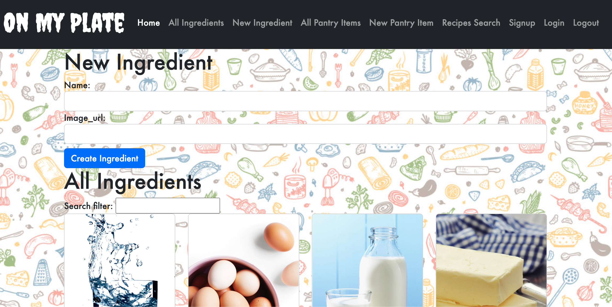

# On My Plate

Welcome to On My Plate, a ruby on rails API app that uses a public food API, [Spoonacular](https://spoonacular.com/), to meal plan recipes.

Recently, I have been feeling like I have a lot on my plate and not enought of it is food. In my desperate attempt to learn how to cook, I decided to create an app that can help me keep track of what I have in my pantry and find recipes based on those ingredients! This way, I have a little less on my plate and more in my stomach!

With this app, users can signup for an account and see a list of ingredients in their pantry. Users can add ingredients to the pantry and search recipes using the ingredients they already have.

Using `ruby "3.1.2"` and a rails gem `"rails", "~> 7.0.4"` for the backend and react for the front end, I was able to implement the recipe API.

## Ruby version

ruby "3.1.2"

"rails", "~> 7.0.4"

## Backend Installation

```bash
bundle install
rails db:create db:migrate db:seed
```

## Backend Usage

```bash
rails server
```

## Frontend Installation

The React Node project frontend is located in the `recipe-meal-planner-frontend` folder.

```bash
npm install
```

## Frontend Usage

```bash
npm run dev
```

## Roadmap

For the future, the next step is to add a favorite button that alows the user to favorite recipes and therby save them. Also, I would like to implement a calendar where the user is able to plan out recipes. The end goal is to try to turn this meal planner into a mobile app.
